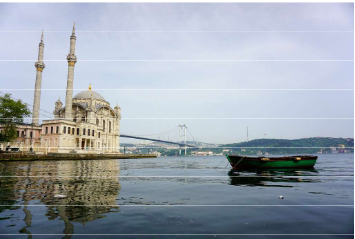
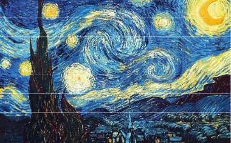
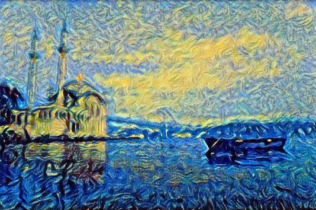

# Artistic Neural Style Transfer
This approach of Artistic Neural Style Transfer separates a style from and image and adds it to another. For style and content feature extraction, a VGG-19 model is used. We research the influence of different VGG-19 layers on the local and global style features. The code of this research is based on the tutorial from https://www.tensorflow.org/tutorials/generative/style_transfer.

An example of the original image, the used style and the resulting image:

  
  
  

